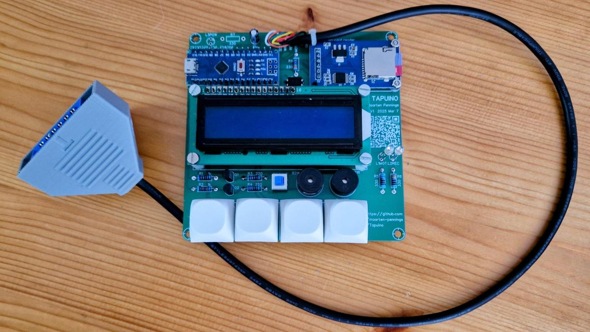

# Assembly

In this directory you find my assembly results.

## Bare PCB

The 5 PCBs arrived after only 4 working days.
I ordered them without assembly, so that was my next step.

There are some [errors](https://github.com/maarten-pennings/Tapuino/tree/main/pcb#errors) in the V1.5 PCB.

These are the steps I followed for my second assembly.

- First, I flashed the Arduino Nano with a "blinky plus println".
  I'm glad I did this. The Nano did start, but it did not enumerate over USB.
  I discovered a capacitor was knocked off the board. When I mounted one back, all was fine.
  
  I flashed the Arduino Nano with the Tapuino [firmware](https://github.com/maarten-pennings/Tapuino/tree/main/firmware/tapuino).
  Unfortunately, it is hard to test on the bare board; I connected the LCD with clipwires 
  and saw `Init failed!`, which make sense because there is no SD board connected yet.

- I removed the power LED from the Nano.
  You do not need to do this, but the white casing is not opaque enough to block it, so I don't like it.

  I soldered the Nano, on pin headers, with the long side of the pins up.
  Otherwise they stick out at the bottom where there is not enough room, so a lot of clipping would then be needed.

- I soldered the LCD with SDA and SCL as wires instead of pin headers.
  This is needed because due to **PCB error**, they need to be crossed.

  
  
  I forgot, but I should have removed the red LED.
  Then I secured the LCD with standoffs 10mm. 
  
- Next I did the SD module. I first removed the existing pin header because I want the SD card slot at the top.
  Next I soldered the SD module on the PCB and secured it with on bolt, thick washer/spacer and a nut.

  Powering up the board now (with a working SD card inserted), no longer causes an error message on the LCD.
  
- The sound components needed to be placed before the keys (room wise),
  so the two buzzers, the mute button, four resistors and two transistors were placed next.
  
- I soldered the four cherry switches.

  Powering up the board in this stage, allow us to navigate the menu with the buttons.
  
- To test the sound, I needed to add the optocoupler, because via the optocoupler the "load" signal comes in.
  Here I needed to work around the second **PCB error**.
  The anodes and cathodes of the optocoupler are swapped; "fortunately" I did that twice, for the emitter as well as the detector.
  The second patch was to turn the optocoupler on its back, bending all 4 legs 180°.

  
  
  The pin 1 was is no longer at the lower right (where the marking dot is) but at the upper right (to wards R8).

  When you now power the board, and select a file to play, the Nano is waiting for 5V on MOTOR.
  By short circuiting the MOTOR and 5V on J1C64 playback should start: animation on the LCD and
  sound (remember to toggle the mute button - SW4MUT - if you don't hear beeps).

- Finally, I mounted the 10u cap, and the green (L1MOT) and red (L2REC) LEDs with their resistor (R5, R6).
  I did not mount the power LED (L3POW) with its resistor (R7).
  It is not really a **PCB error**, but I replaced R5 330Ω with 1000Ω, because it would be too bright.
  
  I repeated the play test from the previous step, now also the green LED switches on.

## With cable

The PCB seemed to work fine on USB, faking motor on by short circuiting the MOTOR and 5V on J1C64.

Next step was to add the cable with my own printed connector sleeve.

## Assembly completed

In the following photos you see the Tapuino in action.

(end)
