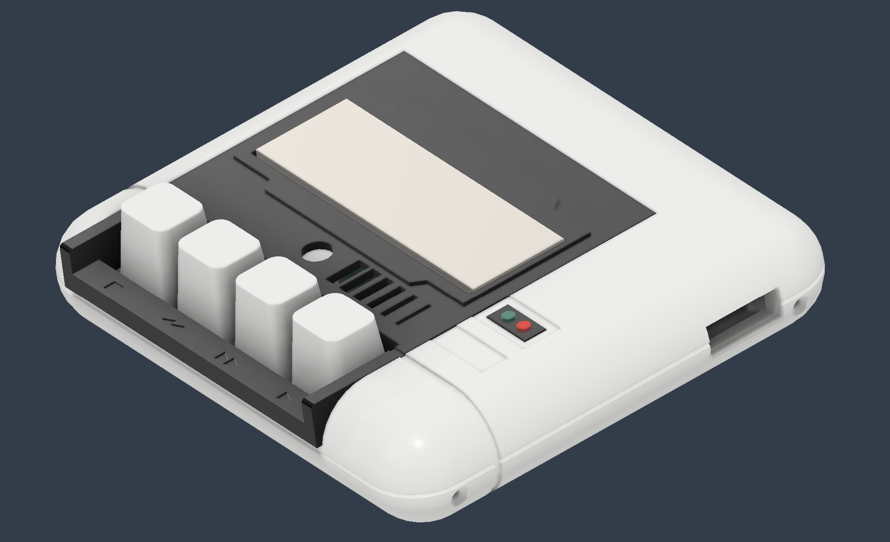

# Tapuino case

This directory contains the 3D printing files.

## Sleeve

I bought a 2x6 pins [PCB connector](https://www.aliexpress.com/item/33015746310.html).
I designed a sleeve for that, that is supposed to look a bit like the original:

This is my version.
The [stl](sleeve-square.stl) is in the repo.

  

## Tapuino case V1

I also made a casing for the Tapuino itself.
I wanted it to look like the original datasette.

This is the result of a couple of evenings with Fusion 360.

It consists of a bottom half ([STL](ShellBot.stl)) and a top half ([STL](ShellTop.stl)) and the top half has a black inlay ([STL](Inlay.stl)).

I made prototypes with my 3D printer, but then ordered at [JLCPCB](https://jlcpcb.com/DMP).
I did go for low(est) cost in material and shipping: €17.30.

Unfortunately, I got a mail from JLCPCB:

> Due to the geometry of this workpiece, there is a high risk of deformation.
> Usually, for flat parts, frame parts, enclosures with no strong ribs inside, and large unoccupied areas parts, long parts and the models could shrink to the center and warping to the diagonal lines and edges.
> Could you please confirm if the risks are acceptable for you?

## Tapuino case V2

I decided to follows JLCPCB's advise and add some ribs; to the bottom half ([STL](ShellBot2.stl)), the top half ([STL](ShellTop2.stl)), and even to the inlay ([STL](Inlay2.stl)),
and to resubmit my order.

Again, I did got for low(est) cost in material and shipping, but more plastic, €1.50 higher cost:

## Result V2

## Tapuino case V3

I friend wanted one, so I made some changes to V2.

- LCD gap a bit smaller.
- Lower the (new) ribs in the corner of the bottom, because it prevents the top to go completely down.
- Chamfer the edge of the bottom and top, because I liked the effect of the two halves not completely closing.
- Add an extra rib in the top, because there was a bit of warping in the print I got from JLCPCB.
- I made the chamfer for the heads of the screws that keep the two halves together a bit deeper.
- Now have hex gaps for nuts for the screws that keep the two halves together.
- Added to recessed panels at the top (for the counter and the save LED).
- Added version tags in all three prints.

Here are the (renders of the parts), the bottom half ([STL](ShellBot3.stl)), the top half ([STL](ShellTop3.stl)), and the inlay ([STL](Inlay3.stl)).

This is the render of the assembly.

(end)
