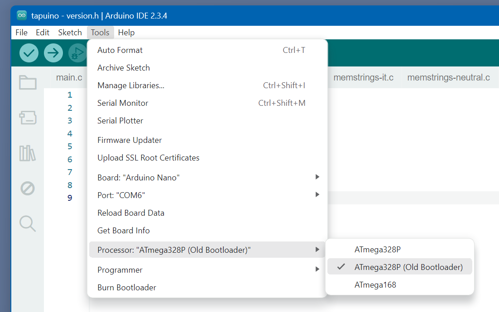

# Firmware

Some notes on the Tapuino firmware.


## My findings

- The UI also has a COMMAND_SELECT_LONG and COMMAND_ABORT_LONG.
  They are especially relevant in manual filename entry.
  
  - Short SELECT means start editing next character.
  - Long SELECT means select character, stop entering characters, start recording the file.
  - Short ABORT means go back to editing previous character.
  - Long ABORT means stop entering file name.

- Lowercase `m` on the LCD means waiting for motor power by C64.
  Uppercase `M` means C64 powers the motor.


## My changes

- I changed all sources to have uniform line endings.

- Suppressed a [warning ](https://github.com/maarten-pennings/Tapuino/blob/main/firmware/tapuino/ccsbcs_avr.c#L9).

- Fixed some typos (eg [Ether](https://github.com/maarten-pennings/Tapuino/blob/main/firmware/tapuino/config.h#L9)).

- In the "file browser" shown with "play" I filtered out also _hidden_ and _system_ files.
  See [source](https://github.com/maarten-pennings/Tapuino/blob/main/firmware/tapuino/fileutils.c#L8).
  The "system" was needed because windows creates a some funny system directory each time I plug in the SD card in my system.
  I added  "hidden" because this allows me to add some files (documentation, images) that I do not want to pop up in the Tapuino browser.

- Replaced hard-coded sizes with expression (eg [`sizeof(ppitems)/sizeof(ppitems[0])`](https://github.com/maarten-pennings/Tapuino/blob/main/firmware/tapuino/menu.c#L266)
  and line [357](https://github.com/maarten-pennings/Tapuino/blob/main/firmware/tapuino/menu.c#L367), and 
  [457](https://github.com/maarten-pennings/Tapuino/blob/main/firmware/tapuino/menu.c#L457)).

- I was confused by `TAPE_READ_LOW` which sometimes referred to a LED. Changed that to [signal](https://github.com/maarten-pennings/Tapuino/blob/main/firmware/tapuino/tapuino.c#L453).

- Added my `config-user.h`.

- I bumped the version from 2.10.0 to 2.11.0.

- Added character prediction to manual [file name entry](https://github.com/maarten-pennings/Tapuino/blob/main/firmware/tapuino/menu.c#L178).
  See also [next char](https://github.com/maarten-pennings/Tapuino/blob/main/firmware/tapuino/memstrings-neutral.c#L7) definition.
  
- I bumped the version from 2.11.0 to 2.12.0.

- Changed startup message from `INIT... V: 2.12.0` to `Tapuino 2.12.0`

- I bumped the version from 2.11.0 to 2.13.0.


## Uploading

Upload failed at first. Forgot my nano has an "old" bootloader.




Memory usage is relatively low

```
Sketch uses 26868 bytes (87%) of program storage space. Maximum is 30720 bytes.
Global variables use 1608 bytes (78%) of dynamic memory, leaving 440 bytes for local variables. Maximum is 2048 bytes.
```

In 2.12.13

```
Sketch uses 26990 bytes (87%) of program storage space. Maximum is 30720 bytes.
Global variables use 1608 bytes (78%) of dynamic memory, leaving 440 bytes for local variables. Maximum is 2048 bytes.
```

(end)