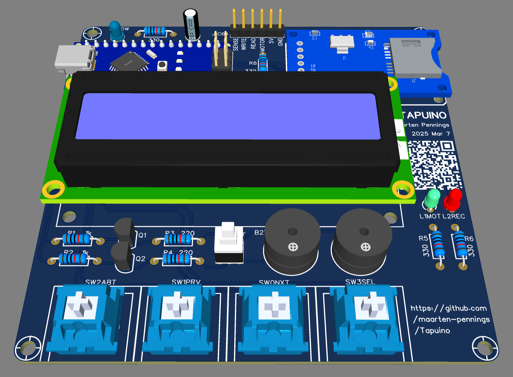
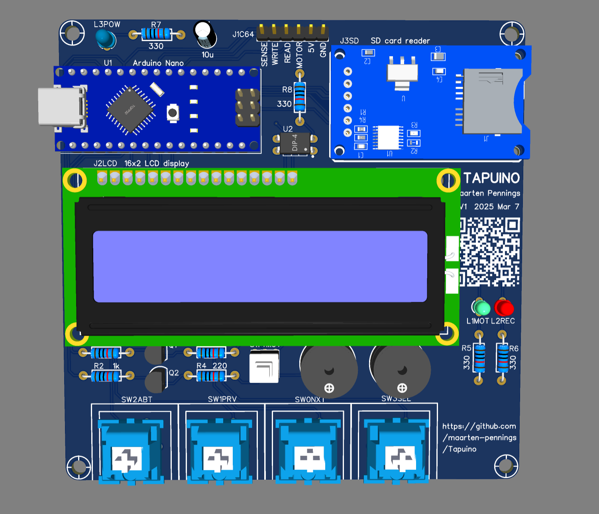
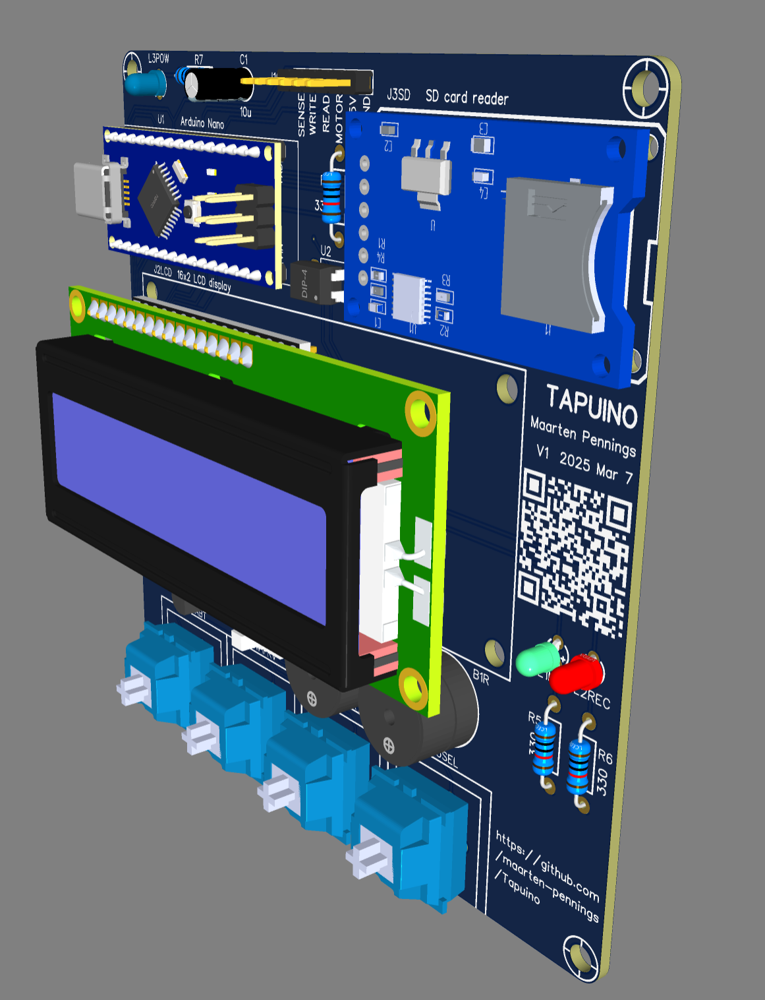

# PCB

In this directory you find my design of the PCB for the Tapuino.

## Schematics

I made the schematics in [EasyEda](https://easyeda.com).
Files are stored in their cloud, but you can also download the [source](Tapuino-sch-v1.json).
Not sure how many other tools can process those files.
To be sure, I also exported a [pdf](Tapuino-sch-v1.pdf).

## Layout

Next step is layout, also done in EasyEda. Also here the [source](Tapuino-pcb-v1.json) downloaded from the cloud.
And the pds's, not sure how useful that is, one with [top](Tapuino-pcb-v1-top.pdf) view and one with [bottom](Tapuino-pcb-v1-bot.pdf) view.

## Renders

Those fabulous makers using EasyEda, create wonderful "models", in this case I needed three: for the Arduino nano,
for the SD card reader, and for the LCD screen. Found all of them. So pretty good looking renders:

## PCB Manufacturing

The final [gerber](Tapuino-gerber-v1.zip) was sent to [JLCPCB](https://jlcpcb.com/DMP).
Manufacturing in 2 days for €1.85 for 5 PCBs. There was 15-day shipping for €1.63, but I opted for
a faster one €6.94

## Components

- [Passive Buzzer](https://www.aliexpress.com/item/1005007548587680.html) 
  ("passive" means it is like a speaker driven by AC, "active" means
  it contains an oscillator driven at DC and it makes one fixed beep tone).
  10 pieces for €1.76.
  
- [Clicky blue Cherry MX switches](https://www.aliexpress.com/item/1005007052759423.html)
  30 for €3.63. I hope the are 1 unit wide (0.75 inch or 19.05mm).
  
- [Key caps](https://www.aliexpress.com/item/1005006477890497.html)
  for the Cherry MX switches. 30 pieces for €10.94.
  
- [SD card reader module](https://www.aliexpress.com/item/1940216307.html) 
  with 3v3 LDO and level shifters. 1 piece €0.50.

- [Arduino Nano](https://www.aliexpress.com/item/4000310677263.html)
  with micro USB (maybe I should have gotton USB C). 1 piece for €2.94.
  
- [16x2 LCD with I2C adapter](https://www.aliexpress.com/item/1005006964073869.html).
  I took the blue one. 1 for €2.62.
  
- [Opto coupler](https://www.aliexpress.com/item/1005006281381268.html).
  I did not get this one, had them on stock.
  
- [Mute button](https://www.aliexpress.com/item/32699676258.html).
  I used the "self locking" (blue) with 2mm pitch. 
  It is a double pole, double throw; 40 switches for €2.49.
  
- Several resistors, LEDs, transistors, one capacitor.

(end)