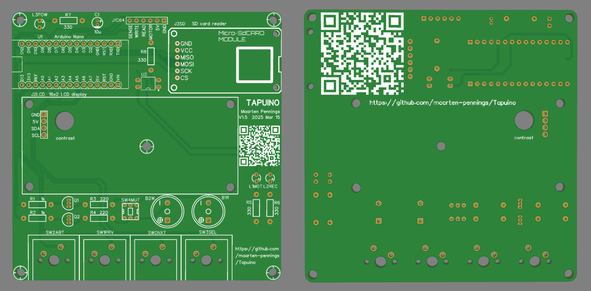
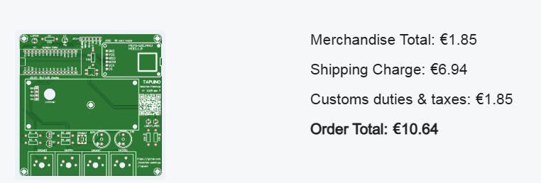

# Tapuino PCB

In this directory you find my design of the PCB for the Tapuino.

## Schematics

I made the schematics in [EasyEda](https://easyeda.com).
Files are stored in their cloud, but you can also download the [source](Tapuino-sch-v1.5.json).
Not sure how many other tools can process those files.
To be sure, I also exported a [pdf](Tapuino-sch-v1.5.pdf).

Note that I have two sound "channels" one for recording and one for playback.
That is a big overkill, but I didn't want to complicate the schematics
by having two inputs (READ and WRITE pin) to one speaker. It adds a bit of PCB area.
Cost-wise it is not much of a problem, the entire two-channel solution costs less 
than 50 cent (35 for the two buzzers, 6 for the mute button and some cents for the
resistors and transistors). If you don't want sound, you can skip this part of the
schematics.

I made a couple of errors in the V1 design that are fixed in the V1.5 design
- SCL/SDA were swapped on the Arduino Nano.
  This was patched by replacing two pins in the pin header of the LCD by wires and crossing those.
- Pins 1/2 and 3/4 were swapped on the optocoupler (U2).
  This was patched by placing the optocoupler upside down (bedning all pins 180 degrees).
- Green LED (L1MOT) was too bright.
  Changed R5 from 330 Ω to 680 Ω.

## Layout

Next step is layout, also done in EasyEda. Also here the [source](Tapuino-pcb-v1.5.json) downloaded from the cloud.
And the pdf's, not sure how useful that is, one with [top](Tapuino-pcb-v1.5-top.pdf) view and one with [bottom](Tapuino-pcb-v1.5-bot.pdf) view.

I tried to follow the layout of the original datasette: big buttons at the front;
the tape (LCD) in the center; tape counter (2 LEDs) on the center right; nothing at the back 
except the cable to the C64.

QR code to this repo for on the PCB.

I made a couple of changes in the v1.5 Layout
- Moved the right-side holes of the SD card PCB a bit to the left
- Moved the contrast hole up.

## Renders

Those fabulous colleague makers using EasyEda, create wonderful "models".
I needed three: for the Arduino Nano, for the SD card reader, and for the LCD screen.
I found all of them, with full details and colors.
So I have pretty good looking renders of my PCB:

## PCB Manufacturing

The final [gerber](Tapuino-gerber-v1.5.zip) was sent to [JLCPCB](https://jlcpcb.com/DMP).
Manufacturing in 2 days for €1.85 for 5 PCBs. There was 15-day shipping for €1.63, but I opted for
a faster one €6.94.

I ordered on Friday, they arrived at my house (The Netherlands) the next Thursday - four working days.

(end)
