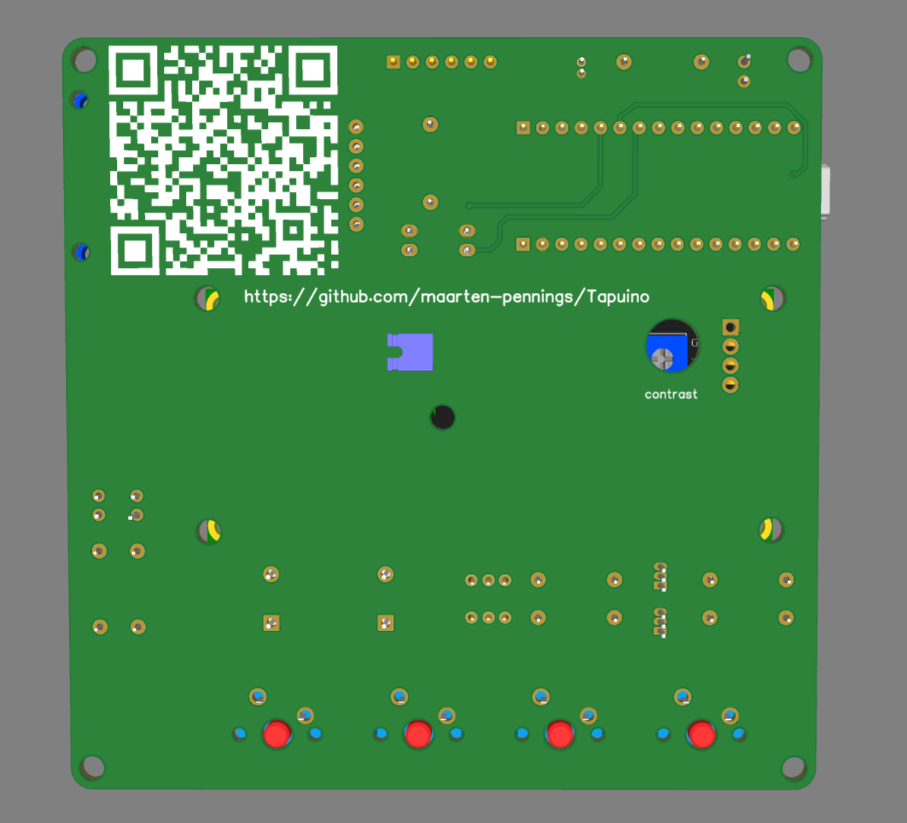

# Tapuino PCB

In this directory you find my design of the PCB for the Tapuino.

## Schematics

I made the schematics in [EasyEda](https://easyeda.com).
Files are stored in their cloud, but you can also download the [source](Tapuino-sch-v1.5.json).
Not sure how many other tools can process those files.
To be sure, I also exported a [pdf](Tapuino-sch-v1.5.pdf).

Note that I have two sound "channels" one for recording and one for playback.
That is a big overkill, but I didn't want to complicate the schematics
by having two inputs (READ and WRITE pin) to one speaker. It adds a bit of PCB area.
Cost-wise it is not much of a problem, the entire two-channel solution costs less 
than 50 cent (35 for the two buzzers, 6 for the mute button and some cents for the
resistors and transistors). If you don't want sound, you can skip this part of the
schematics.

I made a couple of errors in the V1 design that are fixed in the V1.5 design
- SCL/SDA were swapped on the Arduino Nano.
  This was patched by replacing two pins in the pin header of the LCD by wires and crossing those.
- Pins 1/2 and 3/4 were swapped on the optocoupler (U2).
  This was patched by placing the optocoupler upside down (bedning all pins 180 degrees).
- Green LED (L1MOT) was too bright.
  Changed R5 from 330 Ω to 680 Ω.

## Layout

Next step is layout, also done in EasyEda. Also here the [source](Tapuino-pcb-v1.5.json) downloaded from the cloud.
And the pdf's, not sure how useful that is, one with [top](Tapuino-pcb-v1.5-top.pdf) view and one with [bottom](Tapuino-pcb-v1.5-bot.pdf) view.

I tried to follow the layout of the original datasette: big buttons at the front;
the tape (LCD) in the center; tape counter (2 LEDs) on the center right; nothing and the back 
except the cable to the C64.

QR code to this repo for on the PCB.

I made a couple of changes in the v1.5 Layout
- Moved the right holes SD card a bit to the left
- Moved the contrast hole up.

## Renders

Those fabulous colleague makers using EasyEda, create wonderful "models".
I needed three: for the Arduino Nano, for the SD card reader, and for the LCD screen.
I found all of them, with full details and colors.
So I have pretty good looking renders of my PCB:

## PCB Manufacturing

The final [gerber](Tapuino-gerber-v1.5.zip) was sent to [JLCPCB](https://jlcpcb.com/DMP).
Manufacturing in 2 days for €1.85 for 5 PCBs. There was 15-day shipping for €1.63, but I opted for
a faster one €6.94.

I ordered on Friday, they arrived at my house (The Netherlands) the next Thursday - four working days.

## Components

- [Arduino Nano](https://www.aliexpress.com/item/4000310677263.html)
  with micro USB (maybe I should have gotten USB C). 1 for €2.94.

- [Edge connector](https://www.aliexpress.com/item/33015746310.html);
  3 for €1.96.

- [16x2 LCD with I2C adapter](https://www.aliexpress.com/item/1005006964073869.html).
  I took the blue one. 1 for €2.62.

- [SD card reader module](https://www.aliexpress.com/item/1940216307.html)
  with 3v3 LDO and level shifters. 1 for €0.50.

- [BC547 transistor](https://www.aliexpress.com/item/1005007339082012.html);
  100 for €1.33.

- [LEDs in blue, green, red](https://www.aliexpress.com/item/1005005708510866.html);
  100 for €1.83.
  
- [Passive Buzzer](https://www.aliexpress.com/item/1005007548587680.html)
  ("passive" means it is like a speaker driven by AC, "active" means
  it contains an oscillator driven at DC and it makes one fixed beep tone).
  10 pieces for €1.76.

- [Clicky blue Cherry MX switches](https://www.aliexpress.com/item/1005007052759423.html)
  30 for €3.63. I hope they are 1 unit wide (0.75 inch or 19.05mm).

- [Key caps](https://www.aliexpress.com/item/1005006477890497.html)
  for the Cherry MX switches. 30 pieces for €10.94.

- [Mute button](https://www.aliexpress.com/item/32699676258.html).
  I used the "self locking" (blue) with 2mm pitch.
  It is a double pole, double throw; 40 switches for €2.49.

- [Resistors](https://www.aliexpress.com/item/1005008240285872.html);
  1280 for €7.09.

- [Opto coupler](https://www.aliexpress.com/item/1005006281381268.html);
  20 for €1.09.

- [capacitors](https://www.aliexpress.com/item/1005007426523574.html);
  120 for €2.66.

## Cost

The table below lists the cost.
Be aware that this table is overly positive; it does not include shipping
and it assumes the overshoot parts are useful for another project.
And you might still want a case.

| Name                  | Designator                  | Quantity  |  Price |
|:----------------------|:----------------------------|:---------:|-------:|
| Arduino nano          | U1                          | 1         | € 2.94 |
| Edge connector to C64 | J1C64                       | 1         | € 0.65 |
| LCD module            | J2LCD                       | 1         | € 2.62 |
| Micro SD Card-module  | J3SD                        | 1         | € 0.50 |
| BC547B                | Q1,Q2                       | 2  [0]    | € 0.03 |
| LED 3mm               | L1MOT, L2REC, L3POW         | 3  [0]    | € 0.05 |
| Passive buzzer        | B1R,B2W                     | 2  [0]    | € 0.35 |
| Cherry MX keys        | SW0NXT,SW1PRV,SW2ABT,SW3SEL | 4         | € 0.48 |
| Key caps              | SW0NXT,SW1PRV,SW2ABT,SW3SEL | 4  [0]    | € 1.46 |
| Switch DPDT           | SW4MUT                      | 1  [0]    | € 0.06 |
| Resistor 330Ω         | R5,R6,R7,R8                 | 4  [1]    | € 0.02 |
| Opto coupler PC817C   | U2                          | 1         | € 0.05 |
| Resistor 1kΩ          | R2,R1                       | 2  [0]    | € 0.01 |
| Resistor 220Ω         | R3,R4                       | 2  [0]    | € 0.01 |
| 10u                   | C1                          | 1         | € 0.02 |
| PCB                   | none                        | 1         | € 0.37 |
|                       |                             |           | € 9.62 |

If you want to reduce on cost, you could consider removing all three LEDs, 
the buzzer and its driver circuit. But this is all cents range.
The biggest saving is replacing the cherry switches and caps 
with cheaper switches.
Optional cost reductions are tagged with [] in the cost overview.

(end)
